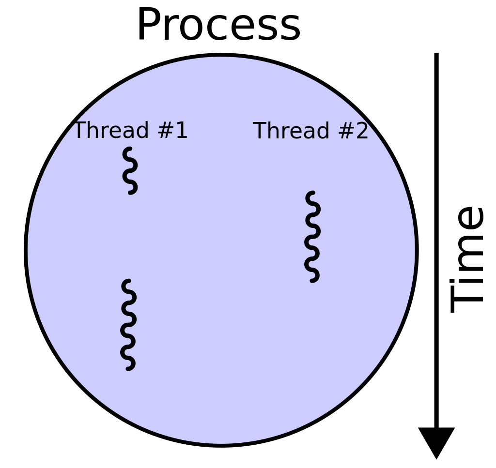

# Explain threads to your grandparents

## Analogy:

Imagine you're baking a cake in the kitchen. Now, when you bake a cake, there are usually different tasks you need to do, like mixing the batter, preparing the frosting, and keeping an eye on the oven.

Threads are like having helpers in the kitchen. Each helper can work on a different task at the same time. For example, one helper can mix the batter, another can prepare the frosting, and you can keep an eye on the oven. This way, you get things done faster, and everyone is working together to make the cake delicious.

## What thread is:

In a computer, threads are like these helpers. They're small parts of a program that can do tasks simultaneously. This makes your computer work more efficiently, just like having helpers in the kitchen makes baking a cake easier and faster. So, threads help the computer do multiple things at once, which is really handy for running programs smoothly and quickly.

Actually a CPU is giving you the illusion that it's doing multiple computations at the same time. It does that by spending a bit of time on each computation. It can do that because it has an execution context for each computation.

### On technical Level:

On a more technical level, an execution context (therefore a thread) consists of the values of the CPU's registers. many tasks can share a CPU.

#### More technical :

A thread is an independent set of values for the processor registers (for a single core). Since this includes the Instruction Pointer (aka Program Counter), it controls what executes in what order. It also includes the Stack Pointer, which had better point to a unique area of memory for each thread or else they will interfere with each other.

Threads are the software unit affected by control flow (function call, loop, goto), because those instructions operate on the Instruction Pointer, and that belongs to a particular thread. Threads are often scheduled according to some prioritization scheme (although it's possible to design a system with one thread per processor core, in which case every thread is always running and no scheduling is needed).

In fact the value of the Instruction Pointer and the instruction stored at that location is sufficient to determine a new value for the Instruction Pointer. For most instructions, this simply advances the IP by the size of the instruction, but control flow instructions change the IP in other, predictable ways. The sequence of values the IP takes on forms a path of execution weaving through the program code, giving rise to the name "thread".

## Program vs Process vs Thread

threads are different from processes. A thread is a context of execution, while a process is a bunch of resources associated with a computation. A process can have one or many threads.

A computer program becomes a process when it is loaded from some store into the computer's memory and begins execution. A process can be executed by a processor or a set of processors. A process description in memory contains vital information such as the program counter which keeps track of the current position in the program (i.e. which instruction is currently being executed), registers, variable stores, file handles, signals, and so forth.
A thread is a sequence of such instructions within a program that can be executed independently of other code.

---

## Resources:

Highly recomend checking this two out. They have some priceless knowledge, these two links

1. [wikipedia](<https://en.wikipedia.org/wiki/Thread_(computing)>)
2. [Stack Overflow](https://stackoverflow.com/questions/5201852/what-is-a-thread-really)
